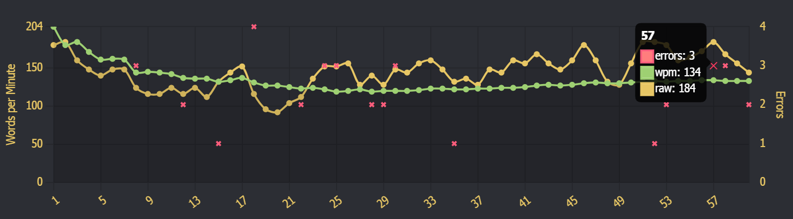
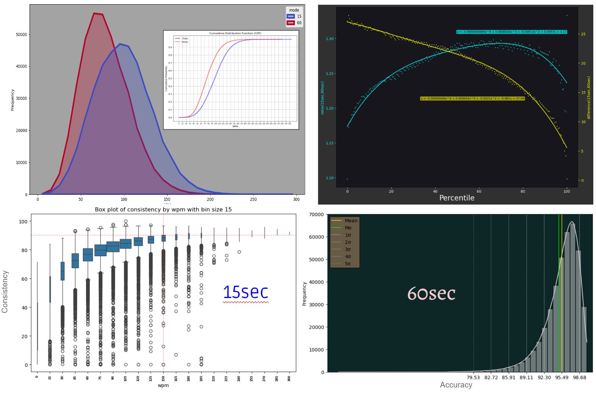
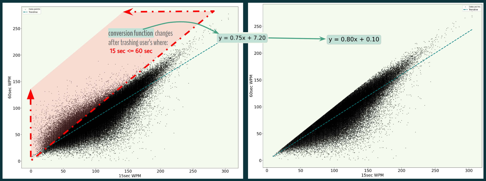

# Visualizing speed typing metrics using data from MonkeyType.com

This analysis was motivated by a desire to gain an intuitive understanding of potential relationships between speed typing performance metrics through rich visualizations.

  

## Process

The following performance metrics are retained for every user's *personal best* WPM score for both the 15 second & 60 second test modes in those respective "All Time Leaderboards":
 - Rank (by WPM > Accuracy >Date)
 - Name
 - WPM (Words Per Minute = characters/5, normalized to 60 seconds)
 - Raw WPM (ignores mistakes)
 - Accuracy (% correct keystrokes)
 - Consistency (per second variance of Raw WPM)
 - Datetime
 
Files:
 - `pull_data.py`           uses the MonkeyType API to pull all ~750K records from both leaderboards, saving them to the "data" dir.
 - `crunch_percentiles.q`   kdb+ script to export percentile correlation tables between the 15/60sec leaderboarda to the "data" dir
 - `plotting.ipynb`         python jupyter notebook to export many different statistical plots to the "plots" dir
 - `conversion_algos.ipynb` explores the optimal strategy for correlating metrics for one mode given a known score for the other

## Premise

My personal best 60 second test (as of 4/20/25) was 132 WPM:

Putting me in 14,805th place, or 3.72%-tile:

My 15 second max is much faster at 155 WPM, but there should be room for improvement given it lands in only the 4.97 %-tile.  

Should I work more on accuracy or consistency to improve my speed?  The data has a story to tell...

## Conclusions

I will leave it to some more based God out there who can type faster than 133 words over the course of a full minute to posit what causal mechanisms (if any) underpin the correlations that are clearly quantifiable (e.g. Pearson's correlation coefficient between consistency and wpm ~ .6, i.e. moderate).  If that sounds like you - then GODSPEED[[*1]](#note-1)! Sharing these preliminary findings with the erudite netizens of MonkeyType's discord has instigated passionate debate.  Personally, I just like interrogating multidimensional graphs.  A 3D scatter plot with a technicolor 4th dimension is the pot of gold at the end of my technicolor rainbow.  To get your hands on some magically delicious viz, use your browser to open any html file within "plots/interactive".

## Addendum

1. Speaking of the Devil - God, if your 15 & 60sec speeds are the same due to being, like, *literally OmNiPoWeRfuLL* or whatever, real talk: I HELLA repent for purging your 15sec score (no cap).

but, like, c'monnn breh it's a little suss my guy. sorry k but like can we be cool again or nah? txt me plzkthx, <3 -bae
